# Nook

<p>
  <a href="LICENSE"></a>
  
  
  
  
</p>

> **An @enchanted-plugins product — algorithm-driven, agent-managed, self-learning.**

The cost ledger for AI-assisted development that learns from every session.

**5 sub-plugins. 5 engines. Per-tier attribution. Event-bus peer degradation. One command.**

> You just ran `/converge` on a Sonnet-heavy prompt. Nook saw 47 calls: Opus orchestrator ($0.06), Sonnet executor over 40 iterations ($2.12), Haiku validator ($0.003). L1 forecast projected end-of-month at $48.20 with ±$3 band against your $50 ceiling. At 80% of the session budget, L2 fired `nook.budget.threshold.crossed` — Flux read the event and dropped `/converge` to Haiku for the next round; Weaver deferred PR polish. L3 flagged iteration 32 as a 3.8σ spike over your rolling mean, cache-hit ratio had fallen from 78% to 12% mid-loop. L5 remembered.
>
> Time: zero developer interruption. Budget preserved. Cache regression surfaced before it compounded.

## Origin

Nook takes its name from **Tom Nook of Animal Crossing** — the shopkeeper who tracks every transaction, remembers every loan, and never closes the books. Nook keeps the same ledger honest: every token, every tier, every pricing change.

The question this plugin answers: *What did it cost?*

## Contents

- [How It Works](#how-it-works)
- [What Makes Nook Different](#what-makes-nook-different)
- [The Full Lifecycle](#the-full-lifecycle)
- [Install](#install)
- [5 Sub-Plugins, 5 Engines, 4 Slash Commands](#5-sub-plugins-5-engines-4-slash-commands)
- [What You Get Per Session](#what-you-get-per-session)
- [The Science Behind Nook](#the-science-behind-nook)
- [vs Everything Else](#vs-everything-else)
- [Agent Conduct (10 Modules)](#agent-conduct-10-modules)
- [Architecture](#architecture)
- [Contributing](#contributing)
- [License](#license)

## How It Works

Nook doesn't just track spend. It **attributes** — every token, every prompt-cache hit, every tool-use turn gets tagged with the plugin / sub-plugin / skill / agent tier / model that fired it. Then it forecasts with honest confidence bands, detects anomalies against your personal rolling mean, and publishes threshold events so peer plugins can **degrade themselves** before you hit the ceiling.

The core innovation is the **attribution contract**: every enchanted-plugins sibling that dispatches work sets the `ENCHANTED_ATTRIBUTION` environment variable before the call. Nook reads it at `PostToolUse`, looks up the model in `shared/rate-card.json`, applies the prompt-cache modifiers (writes at 1.25×, reads at 0.1×, batch at 0.5×), and writes a ledger row. What Anthropic's console shows as one line of "org total" becomes thirty lines of per-plugin-per-tier-per-model reality.

The diagram below shows the five-subplugin architecture: a Claude Code session flows into `cost-tracker` (L1 + L4 — the primary hook consumer), which feeds `budget-watcher` (L2 + L3 — threshold + anomaly detection) and `nook-learning` (L5 — cross-session pattern accumulation). `rate-card-keeper` holds the committed rate card; `cost-query` is the skill-invoked developer surface. Events hit the enchanted-mcp bus only on threshold crossings and rollups — peer plugins (Flux, Weaver, Allay) subscribe and degrade gracefully.

<p align="center">
  <a href="docs/assets/pipeline.mmd" title="View pipeline source (Mermaid)">
    
  </a>
</p>

<sub align="center">

Source: [docs/assets/pipeline.mmd](docs/assets/pipeline.mmd) · Regeneration command in [docs/assets/README.md](docs/assets/README.md).

</sub>

No permission prompts. No manual ledgering. You work; Nook observes, tags, forecasts, and alerts.

## What Makes Nook Different

### It attributes per agent tier, not per parent thread

A single Flux `/converge` run chains Opus (orchestrator, ~$0.06) → Sonnet (executor loop, ~$2.00) → Haiku (validator, ~$0.003). Naïve attribution — what Anthropic's console does — buckets all of it under the parent thread. Opus looks 30× costlier than it is; Sonnet looks free. Nook's `ENCHANTED_ATTRIBUTION.agent_tier` field is set at dispatch time, so every token lands in its actual tier's bucket. **This is what makes `$50/month on Claude Code` answerable.**

### Peer plugins degrade from its threshold events

When L2 fires `nook.budget.threshold.crossed` at 80%, the enchanted-mcp bus delivers it to every subscribed sibling. Flux switches to Haiku for validator-only roles. Weaver defers PR polish to next session. Allay trims context more aggressively. The next 20% of budget buys you careful degradation instead of a silent overrun or a hard kill.

External tools can't do this. Anthropic's console fires email alerts. LangSmith sends Slack notifications. Neither can make *your other plugins* react, because they don't own the peer plugins.

### It surfaces cache waste as dollars, not as a performance metric

Prompt caching is the single biggest lever in Claude Code cost today — and the most opaque. L4 Cache-Waste Measurement tracks cache writes that never get read within the session (1.25× input rate spent for nothing) and reports it in dollars. No other tool does this.

```
Nook cache report (session)
  Hit ratio:              78%
  Read savings:           $0.42 (at 0.10× rate)
  Unread writes:          $0.04 (1.25× rate × 32 tokens)
  Net benefit:           +$0.38
```

### It forecasts honestly

Every L1 forecast ships with its ±2σ confidence band. Point estimates without bands are banned. A forecast that says "$48 end-of-month ±$12" is useful; a forecast that says "$48" is misleading. Honest numbers are the product.

### It remembers your patterns across sessions

L5 Gauss Learning persists per-developer spend patterns — `mu` and `sigma` per `(plugin, skill, agent_tier)` — at a slow α=0.05 update rate so one noisy session doesn't skew the history. When L3 anomaly detection runs on a fresh session with only 5 observations, it falls back to this historical prior. That's how you get "this `/converge` run at $0.80 is 3.3× your rolling mean" on call #6, not call #30.

### It runs zero-cloud

Brand invariant: hooks are bash+jq, scripts are Python stdlib. No external runtime dep. Your ledger lives in `plugins/cost-tracker/state/ledger-YYYY-MM.jsonl` on your disk. Rate card is committed JSON refreshed by nightly CI, not an HTTP fetch on the hot path. Cost data never leaves the machine.

## The Full Lifecycle

A call flows through Nook in four stages moving top to bottom: **SessionStart** (Haiku) loads the committed rate card and mints the session ID; **PostToolUse** (Haiku, repeated per tool call) parses API usage + attribution env, writes the ledger row, then runs L2 threshold + L3 anomaly detection; **PreCompact** (Sonnet) persists per-developer spend patterns via L5's slow α=0.05 accumulator before compaction wipes in-memory state; **Stop** (Haiku) finalizes the daily rollup and emits `nook.session.cost.finalized`. Throughout, the developer can pull spend state on-demand via `/nook-{cost,forecast,attribute,report}` — the query surface is orthogonal to the observation path.

<p align="center">
  <a href="docs/assets/lifecycle.mmd" title="View lifecycle source (Mermaid)">
    
  </a>
</p>

<sub align="center">

Source: [docs/assets/lifecycle.mmd](docs/assets/lifecycle.mmd) · Regeneration command in [docs/assets/README.md](docs/assets/README.md).

</sub>

Every stage is autonomous; the developer surface is pull, not push.

## Install

Nook ships as a 5-sub-plugin marketplace. One meta-plugin — `full` — lists all five as dependencies, so a single install pulls in the whole chain.

**In Claude Code** (recommended):

```
/plugin marketplace add enchanted-plugins/nook
/plugin install full@nook
```

Claude Code resolves the dependency list and installs all 5 sub-plugins. Verify with `/plugin list`.

**Want to cherry-pick?** Individual sub-plugins are still installable — e.g. `/plugin install cost-tracker@nook` if you only want the ledger and no threshold alerts. Missing sub-plugins degrade gracefully (cost-query without cost-tracker shows "no observations yet"; budget-watcher without rate-card-keeper refuses to observe).

**Via shell** (also clones locally so `shared/scripts/*.py` are available):

```bash
bash <(curl -s https://raw.githubusercontent.com/enchanted-plugins/nook/main/install.sh)
```

## 5 Sub-Plugins, 5 Engines, 4 Slash Commands

| Sub-plugin | Owns | Trigger | Agent |
|------------|------|---------|-------|
| [cost-tracker](plugins/cost-tracker/) | L1 Exponential Smoothing + L4 Cache-Waste | hook-driven (PostToolUse) | forecaster (Sonnet) |
| [budget-watcher](plugins/budget-watcher/) | L2 Budget Boundary + L3 Z-Score Anomaly | hook-driven (PostToolUse) | threshold-auditor (Haiku) + anomaly-triager (Opus) |
| [rate-card-keeper](plugins/rate-card-keeper/) | rate card + staleness | hook-driven (SessionStart) | rate-card-validator (Haiku) |
| [nook-learning](plugins/nook-learning/) | L5 Gauss Learning (Nook) | hook-driven (PreCompact) | pattern-learner (Sonnet) |
| [cost-query](plugins/cost-query/) | developer slash commands | skill-invoked | report-narrator (Opus) |

Slash commands from `cost-query`:

| Command | Function | Agent tier |
|---------|----------|------------|
| `/nook-cost [--session\|--day\|--month]` | Current spend with attribution breakdown | Haiku |
| `/nook-forecast [--session\|--day\|--month]` | L1 projection with ±2σ band | Sonnet |
| `/nook-attribute [--last=N] [--tool=<name>]` | Break down last N calls by any axis | Haiku |
| `/nook-report` | Dark-themed PDF audit with Opus anomaly narrative | Opus + Sonnet |

## What You Get Per Session

```
plugins/cost-tracker/state/
├── ledger-2026-04.jsonl      Append-only per-call rows with full attribution
├── session.json              Current session snapshot (for status line)
└── rollups/
    └── daily-2026-04-19.json Daily pre-aggregated rollup (forever retention)

plugins/budget-watcher/state/
├── budgets.json              Per-scope ceilings (developer config)
├── counters.json             Running per-scope totals
├── thresholds.jsonl          Debounce state + audit trail of every crossing
└── anomalies.jsonl           L3 detection log

plugins/nook-learning/state/
└── learnings.json            Per-developer patterns (α=0.05 accumulated)

shared/
├── rate-card.json            Per-model rates + modifiers (committed, CI-refreshed)
└── learnings.json            Cross-plugin exported patterns
```

The **PDF audit report** from `/nook-report` includes: session total + forecast band, attribution pie (plugin × tier × model), L2 threshold-crossing timeline, L3 anomaly list with Opus-narrated diagnoses, L4 cache-waste breakdown, L5 delta from your rolling mean.

## The Science Behind Nook

Every Nook engine is built on a formal mathematical model. Full derivations in [`docs/science/README.md`](docs/science/README.md).

### Engine L1: Exponential Smoothing Forecast

$$\hat{y}_{t+1} = \alpha \cdot y_t + (1 - \alpha) \cdot \hat{y}_t, \quad \alpha = 0.3$$

$$\sigma_{\text{forecast}} = \text{stdev}(\{y_t - \hat{y}_t\}_{t=1}^{n}) \quad \text{band} = \hat{y}_{t+H} \pm 2\sigma$$

Weighted moving average over the ledger's per-call cost series. Three horizons (session, day, month). Confidence band computed from residual variance — a single-value point estimate without band is banned. α is configurable but α=0.3 balances responsiveness against noise for typical Claude Code session cadence.

### Engine L2: Budget Boundary Detection

$$\text{fire}(t, s, k) \iff \frac{\text{cost}(s, k)}{\text{ceiling}(s)} \geq t \quad \text{AND} \quad (t, s, k) \notin \text{debounce}$$

Per-scope counters maintained across (session, hour, day, month) × (agent tier) × (model). Thresholds at 50/80/100%. Debounce is mandatory: once `(threshold, scope, scope_key)` fires, it does not re-fire within that window. Without debounce, N calls past the threshold would produce N events — floods the bus and trains the developer to mute.

### Engine L3: Z-Score Cost Anomaly

$$z = \frac{y - \mu}{\sigma}, \quad \text{anomaly} \iff |z| > 3$$

Rolling μ and σ computed over the last 30 calls matching the same `(plugin, sub_plugin, skill, agent_tier, model)` tuple. For sessions with N<30, falls back to L5's persisted historical prior. Alerts on both **spikes** (unusual cost increase — the common case) and **drops** (signals cache-hit wins or rate-card drift — also worth surfacing). Uses population stdev, not sample: we have the full observed window, not a sample from a larger population.

### Engine L4: Cache-Waste Measurement

$$\text{hit\\_ratio} = \frac{R}{R + W + M}, \quad \text{waste\\_usd} = W_{\text{unread}} \cdot r_{\text{input}} \cdot c_{\text{write}}$$

Where `R`, `W`, `M` are cache read / write / miss token counts; `W_unread` is the subset of writes with no downstream read in the session; `r_input` is the input rate; `c_write = 1.25` is the cache-write modifier. Surfaces the dollar cost of prompt-cache misses as a first-class signal, not a performance-table afterthought.

### Engine L5: Gauss Learning (Nook)

$$\mu_{n+1} = (1 - \alpha) \cdot \mu_n + \alpha \cdot \bar{y}_{\text{session}}, \quad \alpha = 0.05$$

Slow accumulator: one noisy session barely moves learned μ and σ. Update runs at PreCompact per `(plugin, skill, agent_tier)` attribution key. Persisted in `state/learnings.json` with Allay-A4 atomic serialization (write-to-tmp + fsync + rename). Exported to `shared/learnings.json` under the `nook` section so peer plugins can read Nook's knowledge for their own cost-aware judgments.

---

*The math runs as code in [`shared/scripts/`](shared/scripts/). Every script is stdlib-only per brand invariant.*

## vs Everything Else

| | Nook | Anthropic Console | LangSmith | Helicone | PromptLayer |
|---|---|---|---|---|---|
| Per-plugin attribution | ✓ | — | partial | partial | — |
| Per-agent-tier attribution (Opus/Sonnet/Haiku in one chain) | ✓ | — | — | — | — |
| Per-skill attribution | ✓ | — | partial | — | — |
| Prompt-cache write/read separation | ✓ | summary | — | partial | — |
| Cache-waste detection (unread writes) | ✓ | — | — | — | — |
| Forecasts with honest confidence bands | ✓ | — | — | — | — |
| Threshold events to peer plugins | ✓ | — | — | — | — |
| Z-score anomaly detection | ✓ | — | — | — | — |
| Cross-session learning | ✓ | — | — | — | — |
| Batch API discount tracking | ✓ | ✓ | — | ✓ | — |
| Runs locally, zero cloud egress | ✓ | cloud | cloud | cloud | cloud |
| Dependencies | bash + jq + stdlib | — | Python SDK | Python SDK | SaaS |
| Price | Free (MIT) | included | $$ | $$ | $$$ |

## Agent Conduct (10 Modules)

Every skill inherits a reusable behavioral contract from [shared/conduct/](shared/conduct/) — loaded once into [CLAUDE.md](CLAUDE.md), applied across all plugins. This is how Claude *acts* inside Nook: deterministic, surgical, verifiable. Not a suggestion; a contract.

| Module | What it governs |
|--------|-----------------|
| [discipline.md](shared/conduct/discipline.md) | Coding conduct: think-first, simplicity, surgical edits, goal-driven loops |
| [context.md](shared/conduct/context.md) | Attention-budget hygiene, U-curve placement, checkpoint protocol |
| [verification.md](shared/conduct/verification.md) | Independent checks, baseline snapshots, dry-run for destructive ops |
| [delegation.md](shared/conduct/delegation.md) | Subagent contracts, tool whitelisting, parallel vs. serial rules |
| [failure-modes.md](shared/conduct/failure-modes.md) | 14-code taxonomy for `state/learnings.json` so L5 Gauss Accumulation compounds |
| [tool-use.md](shared/conduct/tool-use.md) | Tool-choice hygiene, error payload contract, parallel-dispatch rules |
| [formatting.md](shared/conduct/formatting.md) | Per-target format (XML / Markdown sandwich / minimal / few-shot), prefill + stop sequences |
| [skill-authoring.md](shared/conduct/skill-authoring.md) | SKILL.md frontmatter discipline, discovery test |
| [hooks.md](shared/conduct/hooks.md) | Advisory-only hooks, injection over denial, fail-open |
| [precedent.md](shared/conduct/precedent.md) | Log self-observed failures to `state/precedent-log.md`; consult before risky steps |

## Architecture

Interactive architecture explorer with sub-plugin diagrams, agent cards, and event flow:

**[docs/architecture/](docs/architecture/)** — auto-generated from the codebase. Run `python docs/architecture/generate.py` to regenerate.

## Contributing

See [CONTRIBUTING.md](CONTRIBUTING.md).

## License

MIT — see [LICENSE](LICENSE).

---

Repo: https://github.com/enchanted-plugins/nook
